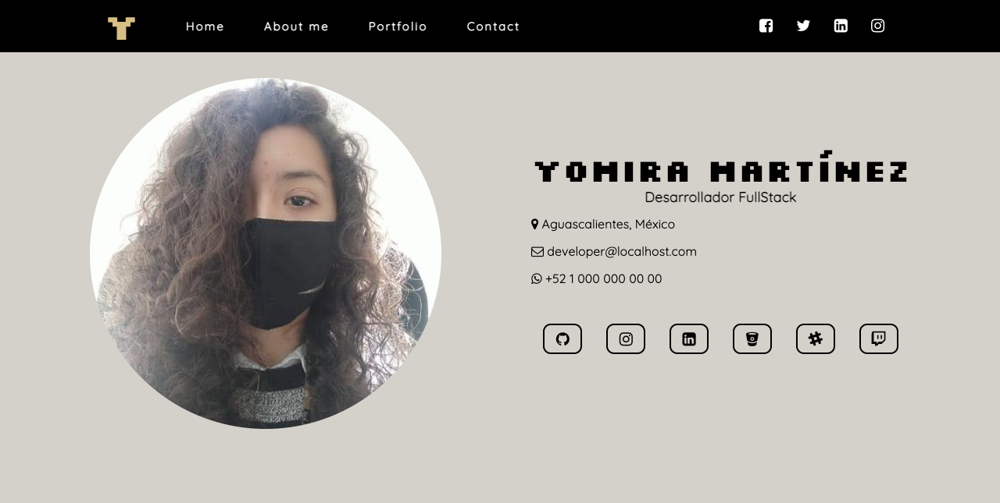
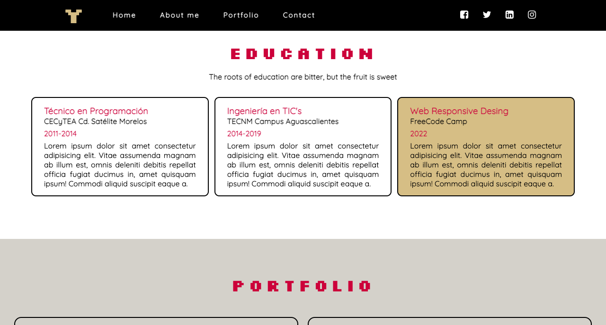

# First-Portfolio

Project's Portfolio for fifth project of the FreeCodeCamp Web Responsive Design course

## Technologies used

- HTML5
- CSS

## Installation

For the project installation; you only need to clone this project on your computer; as the project does not require complicated configurations

## Status

This project was created to practice HTML and CSS. However, I would like to update this project with new technologies like React or Vue. This repository is Open Source; if you want to edit the code; you can do it without problem.

## Screenshots

## Preview

- GitHub Pages: [Click Here](https://yomidev.github.io/First-Portafolio/)

## Author

Yomira Martínez
